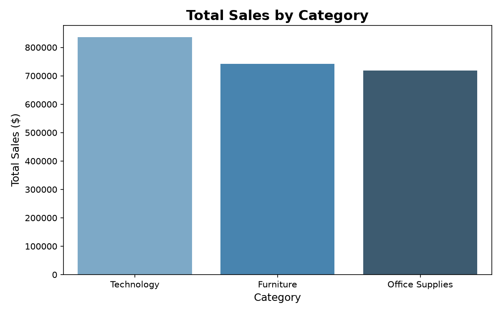
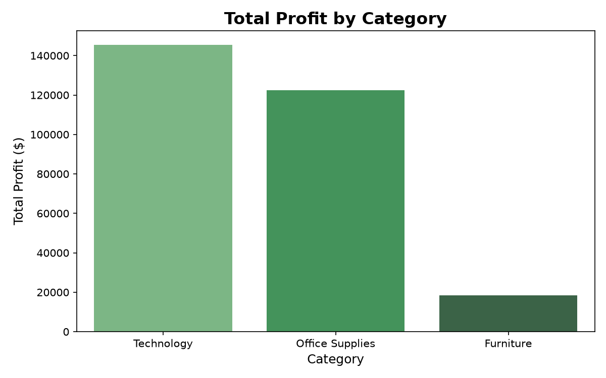
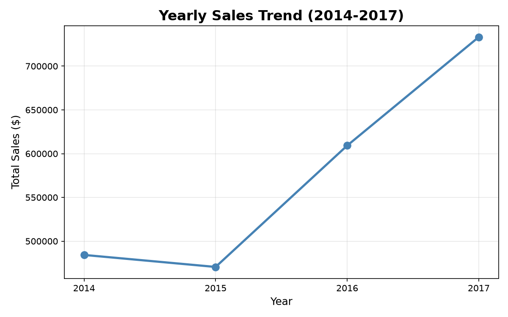
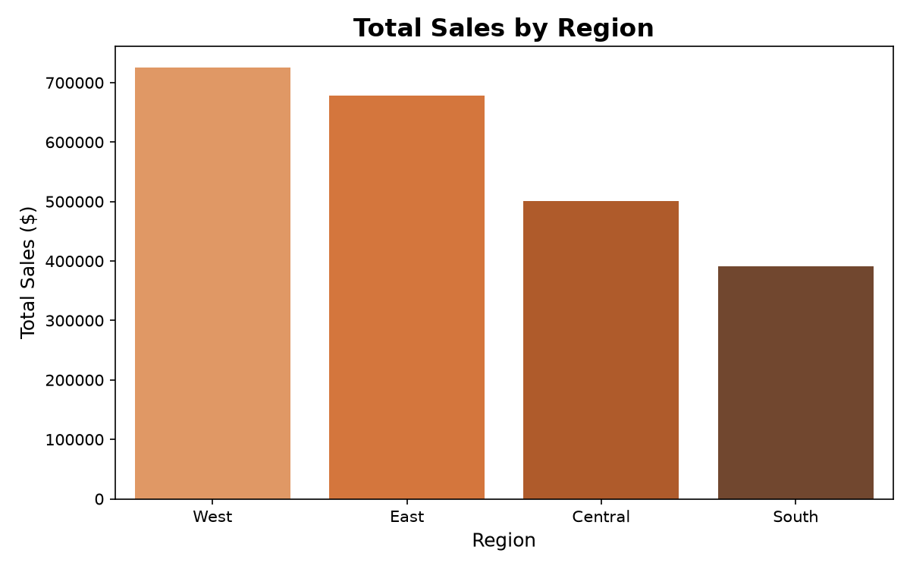
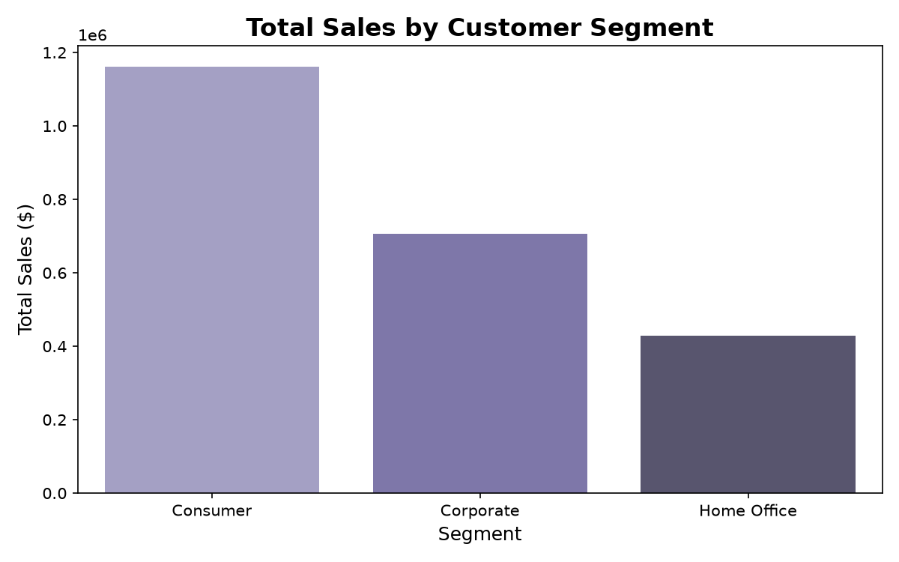
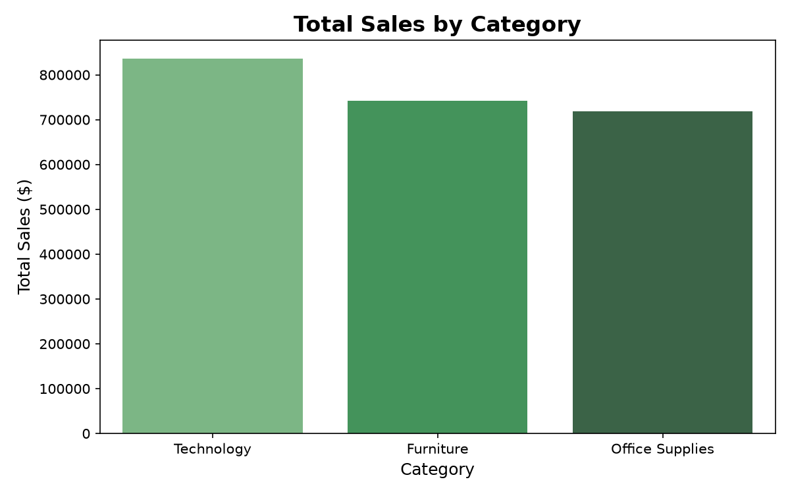
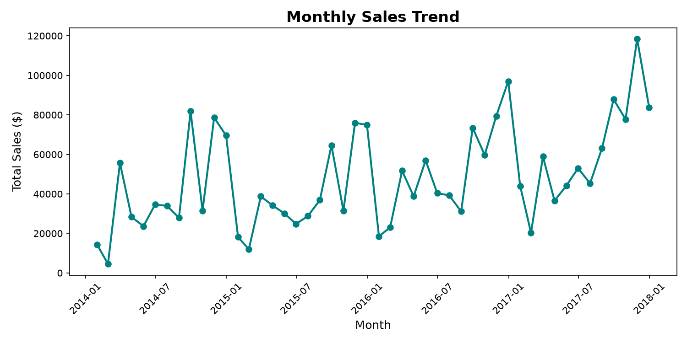
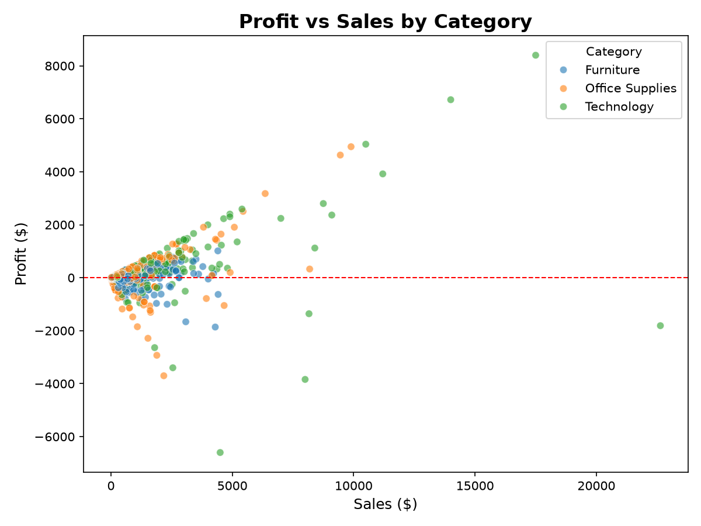
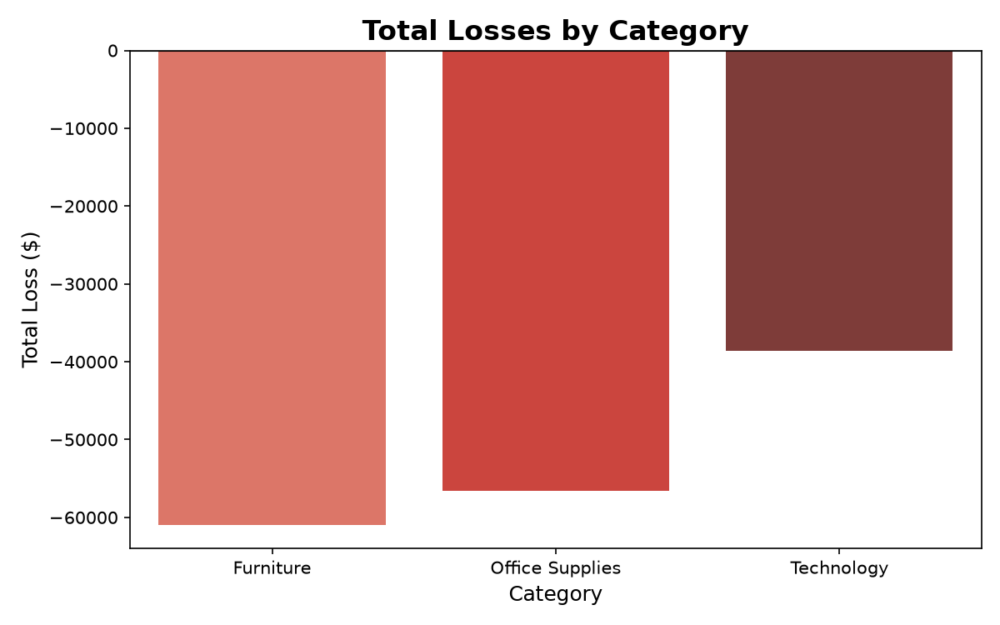
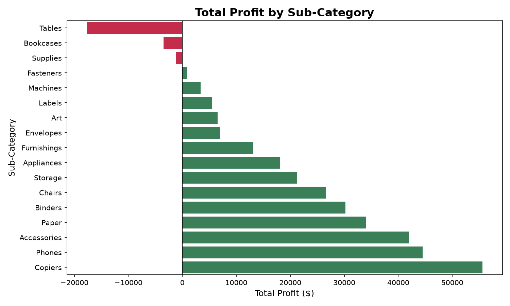

# Superstore Sales EDA | Python

## Objective
Perform Exploratory Data Analysis on 4 years of Superstore 
retail sales data to uncover revenue trends, profit patterns, 
regional performance, and customer segment insights.

## Dataset
- Source: Superstore Dataset (Kaggle)
- Records: 9,994 orders | 21 columns
- Period: 2014 - 2017
- Format: CSV

## Tools Used
- Python 3.12
- pandas (data manipulation)
- matplotlib (visualizations)
- seaborn (statistical plots)
- Jupyter Notebook

## Key Findings
- Technology leads in both sales (~$830K) and profit (~$145K)
- Furniture has high sales but very low profit (~$18K) — unprofitable category
- West region has highest sales (~$725K), South is lowest (~$392K)
- Sales grew consistently from 2015 to 2017 with 2017 being best year
- Consumer segment contributes most to overall sales
- High discounts strongly correlate with negative profit

## Charts Covered
1. Total Sales by Category
2. Total Profit by Category
3. Yearly Sales Trend (2014-2017)
4. Total Sales by Region
5. Sales by Customer Segment
6. Sales by Sub-Category
7. Monthly Sales Trend
8. Profit vs Sales (Scatter)
9. Losses by Category
10. Profit by Sub-Category

## Chart Previews

### Chart 1 - Sales by Category

### Chart 2 - Profit by Category

### Chart 3 - Yearly Sales Trend

### Chart 4 - Sales by Region

### Chart 5 - Sales by Segment

### Chart 6 - Sales by Sub-Category

### Chart 7 - Monthly Sales Trend

### Chart 8 - Profit vs Sales

### Chart 9 - Losses by Category

### Chart 10 - Profit by Sub-Category

## 🚀 How to Run
1. Clone this repository
2. Install libraries: `pip install pandas matplotlib seaborn`
3. Open `Superstore_EDA.ipynb` in Jupyter Notebook
4. Run all cells

---
*Part of my Data Analytics portfolio — [GitHub Profile](https://github.com/Rachitha-Avvaru)*
